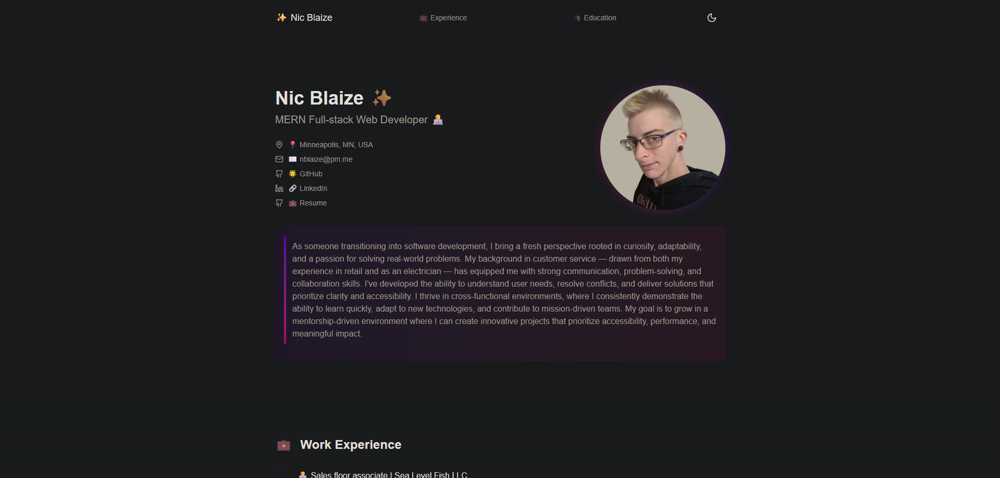

# Astro Portfolio
  

  ## Description
  I made this portfolio to try out Astro and Vercel for the first time, and to show off my updated resume and past projects. I used a free template as a base, which you can check out here: [LINK](https://github.com/rishikesh2003/my-portfolio).

  ## Screenshot
   

  ## Table of Contents
- [Astro Portfolio](#astro-portfolio)
  - [Description](#description)
  - [Screenshot](#screenshot)
  - [Table of Contents](#table-of-contents)
